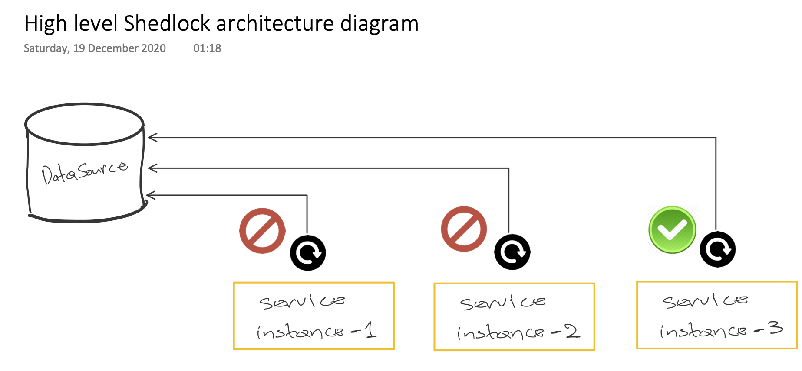
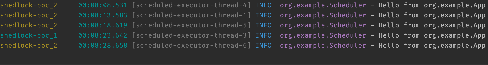

# Shedlock PoC

### A very easy-to-wire-up distributed lock solution for scheduled tasks.

To skip the story: Goto [How to Run](#how-to-run)

## Background

[Shedlock](https://github.com/lukas-krecan/ShedLock) 
is a very well documented library and has already integrated with 
[SpringBoot](https://spring.io/projects/spring-boot) 
and [Micronaut](https://micronaut.io/) way of setting a scheduled task.
Usually, these kind of frameworks can schedule a task with just simply
applying a decorator/annotation like so `@Scheduled` on top of your java
method.

Deploying a `SpringBoot` application or a `Micronaut` (nowadays) into an
orchestration platform like ***Kubernetes*** usually brings some issues; 
these scheduled tasks are bound to the container/vm they're running into.
Meaning that, if we have `3 replicas` of that service that executes a 
`@Scheduled` task, we will experience that task executing `3` times -- once per `replica` of a container.

On a recent task of mine to implement a scheduled task at my work 
which would call a third-party api to:
- fetch some data
- update some other
- and report (after calling again and checking)

Obviously, we wouldn't want our scheduled task to execute these routines
as many times as the `replica number` of the container inside the Kubernetes cluster.
Hence, a colleague of mine introduced me to `Shedlock`.

As mentioned above, ***Shedlock*** already has support on ***SpringBoot***
and ***Micronaut*** so to make it work was no pain at all. The only dependency
required is a `DataSource` -- a DB, cache, etc. The list of all the datastores
that it supports is right [here](https://github.com/lukas-krecan/ShedLock#configure-lockprovider)
```
Mongo
Redis
ElasticSearch
Cassandra
...
and many more!
```

On a high level, ***Shedlock*** creates an index/table where the `id` of the scheduled
task is *locked*, and it will make sure that only one of the instances
will execute the scheduled task. Of course, if one of the instances will fail for any reason,
the lock will be released for the next available!



## How to Run

Requirements:
- docker
- docker-compose

Simply run the `test.sh` at root of the project. It will:
- build the gradle project.
- spin up the `DataSource` and the app that demonstrates `Shedlock`.
- scale by `2` instances for demo.
- sleep for 8 seconds, so the app correctly connects to `DataSource`.
- follow the docker-compose `logs`.

For this demo I have used `Micronaut` and [ElasticSearch](https://www.elastic.co/elasticsearch/service?ultron=B-Stack-Trials-EMEA-UK-Exact&gambit=Elasticsearch-Core&blade=adwords-s&hulk=cpc&Device=c&thor=elasticsearch&gclid=EAIaIQobChMI6_brpt7Y7QIVmLWyCh2uZg_-EAAYASAAEgIP1_D_BwE)
to create a *lock* index.

***Shedlock*** needs just another `annotation` on top of your scheduled task as follows in my example:
```java
@Scheduled(fixedDelay = "5s")
@SchedulerLock(name = "say-hello-scheduler")
void schedule() {
    assertLocked();
    log.info("Hello from {}", App.class.getName());
}
```
along with some extra configuration in `application.yml`
```yaml
shedlock:
  defaults:
    lock-at-most-for: 8s
    lock-at-least-for: 5s
```
You can read all about in the library itself.

And, I guess, the logs indicate the distributed lock solution!



After you've finished, run the `cleanup.sh` which it will tear down the stack.

That's it! Give it a go, I hope this repo helped.
